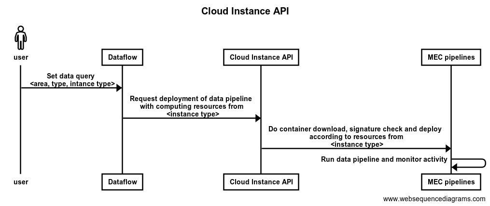

# Overview
This repository contains all necessary stuff to build and deploy cloudinstance-api.

This API is the central access point to request to the different MECs that are part of the platform to deploy instances on them depending on instancetype and datatype.

This repo includes:
 - the scripts to deploy the systen,
 - the definition of APIs and
 - the systems that manage the requests from application consumers on demand.

This module deploys on demand the data pipelines required by data consyumers to process and connect data producers on selected areas to cloud topics.

# Source code
[api](api) folder contains source code. 

# Authors

* Mikel Seron ([mseron@vicomtech.org](mailto:mseron@vicomtech.org))
* Felipe Mogollon ([fmogollon@vicomtech.org](mailto:fmogollon@vicomtech.org))

## License

Copyright : Copyright 2022 VICOMTECH

License : EUPL 1.2 ([https://eupl.eu/1.2/en/](https://eupl.eu/1.2/en/))

The European Union Public Licence (EUPL) is a copyleft free/open source software license created on the initiative of and approved by the European Commission in 23 official languages of the European Union.

Licensed under the EUPL License, Version 1.2 (the "License"); you may not use this file except in compliance with the License. You may obtain a copy of the License at [https://eupl.eu/1.2/en/](https://eupl.eu/1.2/en/)

Unless required by applicable law or agreed to in writing, software distributed under the License is distributed on an "AS IS" BASIS, WITHOUT WARRANTIES OR CONDITIONS OF ANY KIND, either express or implied. See the License for the specific language governing permissions and limitations under the License.
